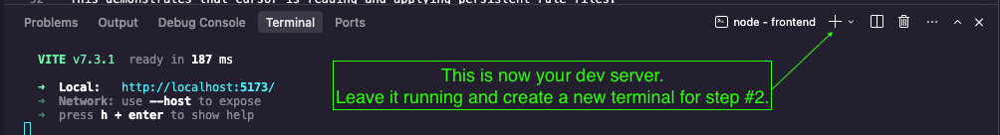
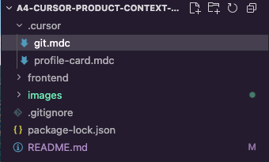
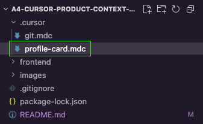

# A4 — Providing Product Context to Cursor  
## Overview • Rules • Intent

This workshop demonstrates how to guide Cursor using product context instead of detailed implementation instructions.

You will:
- [ ] Create a branch following a naming convention
- [ ] Navigate to and refine a product overview + rules file
- [ ] Use Cursor to update a component based on that context
- [ ] Verify changes using `git diff`

Time: ~ 8 minutes

## 1. Clone and Run the App (1 minute)

To clone the repository, in your Cursor terminal, run:

```bash
git clone https://github.com/ld17282/a4-cursor-product-context-workshop.git
```

### a. Navigate into the frontend folder
In your Cursor terminal, run:

```bash
cd frontend
```

### b. Install dependencies and start the dev server
In your Cursor terminal, run:

```bash
npm install
npm run dev
```

### c. Open the local URL shown in your terminal 
The Cursor Terminal will show the local url. Click on it. 


You should see a centered dark profile card.


### ✅ Checkpoint: 
- [ ] The app runs, and you can see the `ProfileCard` component.
- [ ] Leave this terminal running so you can see changes on the frontend in real time.



## 2. Create a Branch (1 minute)

Before making any changes, create a new feature branch for styling the `ProfileCard`. This repository includes a persistent git rule file: `git.mdc` (see file location below). Cursor must follow the branch naming convention defined there.




### a. Branch Naming Convention

All feature branches must follow the format defined by `git.mdc`:


### b. Use Cursor to Create the Branch

In Cursor chat, ask:

> Create a new branch for styling the ProfileCard component. My name is [ENTER YOUR NAME]. Follow the naming convention defined by @git.mdc. 

Cursor should generate and execute a command similar to:

```bash
git checkout -b <your-name/profile-card-styling>
```

### c. Verify

In your new Cursor terminal (not the dev server) run:

```bash
git branch
```

You should see your new branch highlighted:


### ✅ Checkpoint:
- [ ] You are no longer on `main`
- [ ] `your-branch` follows the required naming format. 
This demonstrates that Cursor is reading and applying persistent rule files.

## 3. Refine Product Context and Apply Rules (3–4 minutes)

Now you will guide Cursor using product context instead of detailed implementation instructions.
Your goal is to refine the existing rule file and use it to modify the `ProfileCard` typography and theme.

### a. Refine the Product Context

Open `profile-card.mdc` found in the `.cursor` folder in the root directory. This file already defines conventions and constraints for the `ProfileCard` component.



Your Tasks:

- [ ] Replace the `[TBD]` text under **Product Overview** with a short description (2–3 sentences) describing the overall tone and purpose of the ProfileCard.
- [ ] Adjust **one Typography rule** to reflect your design preference.
- [ ] Adjust **one Theme rule** to reflect your design preference.

Examples of acceptable tweaks:

- Change **Name** size (`text-2xl` → `text-3xl`)
- Adjust **Title** tone (`text-zinc-400` → `text-zinc-500`)
- Modify **Background** color (`bg-zinc-950` → `bg-lime-500`)
- Switch **Name** weight (`font-bold` → `font-semibold`)
- Tweak **Card** border (`border-zinc-800` → `border-lime-900` )

For more **color** options, see the [Tailwind CSS colors documentation](https://tailwindcss.com/docs/colors#working-with-colors).

For more **font weight/size** options, see the [Tailwind CSS Typography documentation](https://v3.tailwindcss.com/docs/font-size).

Do **NOT**:
- Change layout rules
- Modify spacing structure
- Edit button styles
- Remove constraints

### b. Apply the Updated Rules

In Cursor chat, ask:

> Read @profile-card.mdc and update @ProfileCard.tsx to follow the updated Product Overview and rules. Only modify what is allowed by the rule file.

To observe the changes in your browser, in your Cursor terminal, run:
```bash
cd frontend
npm i
npm run dev
```

 Click on the localhost link again. The layout should remain identical. Only colors or typography should have changed.

### c. Verify with Git Diff

In your Cursor terminal, run:

```bash
cd ..
git diff
```

You should see small updates only, primarily changes to Tailwind `className` values in `ProfileCard.tsx`.

### ✅ Checkpoint

- [ ] Some text has changed.
- [ ] One or more colors have changed.
- [ ] Layout has not changed.
- [ ] Diff reflects minimal, rule-driven edits.

This demonstrates how product overview and constraints guide AI behavior without prescribing exact implementation details.


## 4. Complete the Profile Card With Your Info [OPTIONAL]
Replace string values in prompts with your information. Be sure to provide Cursor with `string` values (use "")

### a. Ask Cursor to update the `name` displayed on the `ProfileCard`
In Cursor chat, ask:

> In App.tsx edit the name property's value to the string "REPLACE WITH YOUR NAME"

### b. Ask Cursor to update the `title` displayed on the `ProfileCard`
In Cursor chat, ask:

> In App.tsx edit the title property's value to the string "REPLACE WITH YOUR TITLE"

### c. Ask Cursor to update the `bio` displayed on the `ProfileCard`
In Cursor chat, ask:

> In App.tsx edit the bio property's value to the string "REPLACE WITH YOUR BIO"

### d. Ask Cursor to update the avatar displayed on the `ProfileCard`
- [ ] Download your avatar created during **A1 Figma Tutorials - Chapter 8** 
