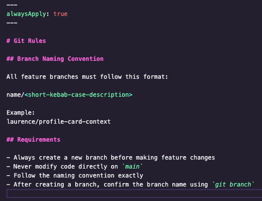
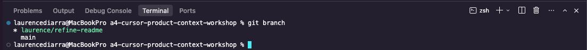

## 1. Clone and Run the App (1 minute)

Clone the repository:

```bash
git clone https://github.com/ld17282/a4-cursor-product-context-workshop.git
```

Navigate into the frontend folder:

```bash
cd a4-cursor-product-context-workshop/frontend
```

Install dependencies and start the dev server:

```bash
npm install
npm run dev
```

Open the local URL shown in your terminal  


You should see a centered dark profile card.


### ✅ **Checkpoint:** The app runs, and you can see the `ProfileCard` component.

---

## 2. Create a Branch (1 minute)

This repository includes a persistent git rule file located at:

```
.cursor/git.mdc
```

Cursor must follow the branch naming convention defined there.


### Branch Naming Convention

All feature branches must follow this format:



### Use Cursor to Create the Branch

In Cursor chat, ask something like:

> Create a new branch for refining the README. Follow the naming convention defined in `.cursor/git.mdc`.

Cursor should generate and execute a command similar to:

```bash
git checkout -b <NAME/FEATURE-NAME>
```

### Verify

Run:

```bash
git branch
```

You should see your new branch highlighted:



### ✅ **Checkpoint:** You are no longer on `main`, and your branch follows the required naming format. This demonstrates that Cursor is reading and applying persistent rule files.

---
