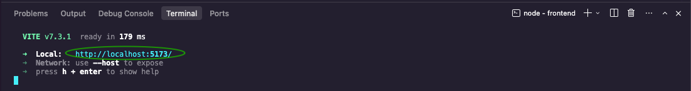
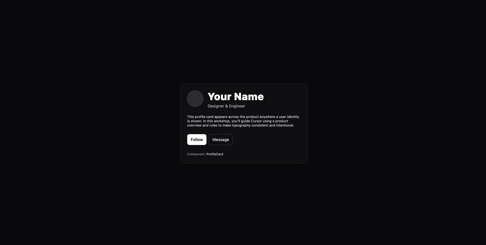

## 1. Clone and Run the App (1 minute)

Clone the repository:

```bash
git clone https://github.com/ld17282/a4-cursor-product-context-workshop.git
```

Navigate into the frontend folder:

```bash
cd a4-cursor-product-context-workshop/frontend
```

Install dependencies and start the dev server:

```bash
npm install
npm run dev
```

Open the local URL shown in your terminal  



You should see a centered dark profile card.



### ✅ **Checkpoint:** The app runs, and you can see the `ProfileCard` component.